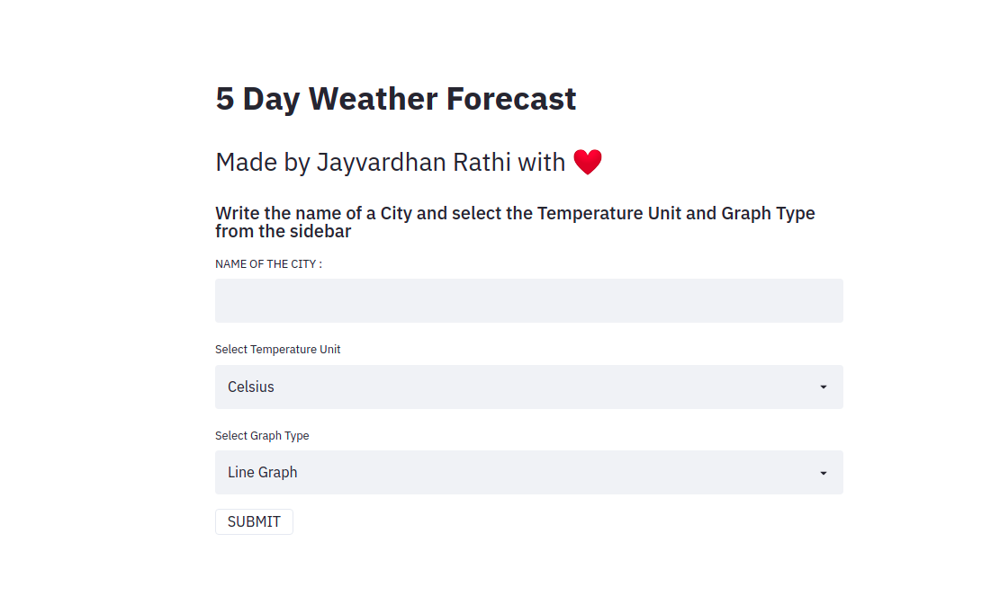
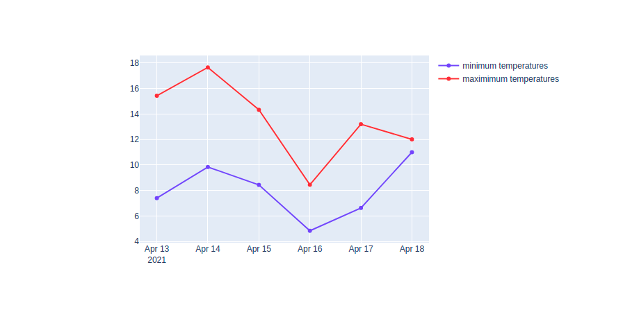
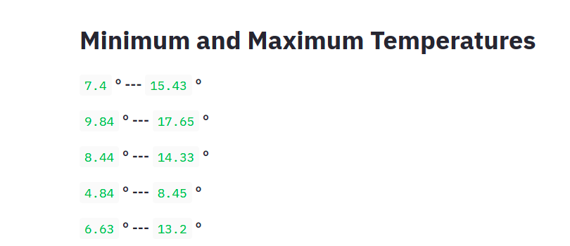
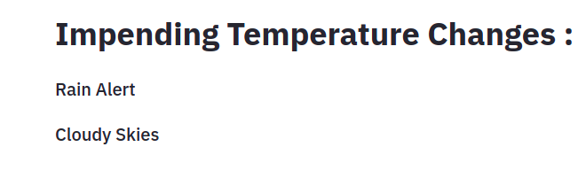
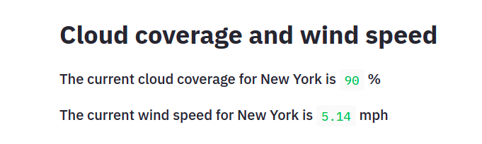
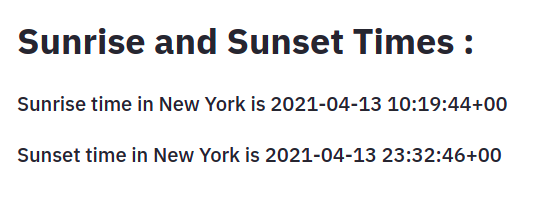

## :fire: Features

- 5 day weather forecast
- Impending Weather changes
- Weather Graph
- Sunrise and sunset times
- CLoud Coverage
- Wind Speed

## :bulb: Built Using

- Python
- Streamlit
- Plotly
- Python Open Weather Map API


## :iphone: Screenshots

|                                        |                                        |
| -------------------------------------- | -------------------------------------- |
|  |  |
|   |   |
|   |   |


## Instructions to run

Git clone this repository.

```pip install -r requirements.txt ```

This installs all the dependencies on your computer using the terminal 

```python app.py```

_now your app is up and running_

<!-- LICENSE -->  

## License

Distributed under the MIT License. See `LICENSE` for more information. 


<!-- CONTRIBUTING -->
## Contributing

Contributions are what make the open source community such an amazing place to be learn, inspire, and create. Any contributions you make are **greatly appreciated**.

1. Fork the Project
2. Create your Feature Branch (`git checkout -b feature/AmazingFeature`)
3. Commit your Changes (`git commit -m 'Add some AmazingFeature'`)
4. Push to the Branch (`git push origin feature/AmazingFeature`)
5. Open a Pull Request  


<!-- CONTACT -->


